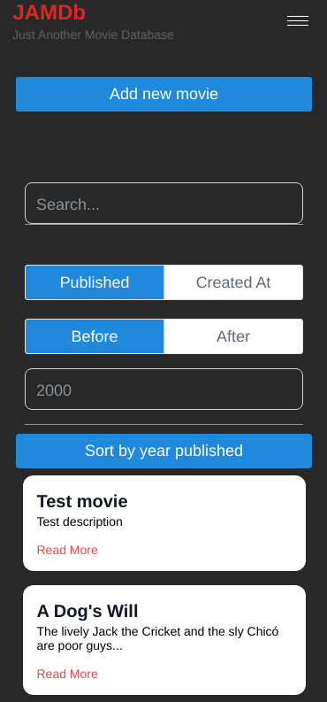

# JAMDB-Native

JAMDb-Native - Just Another Movie Database Native (for iOs and Android) is an application for storing movie information. The application supports multiple functionalities such as searching, adding more movies, sorting and viewing more detailed information.

The application consists a single part. A React Native application that is connected to a backend created in another project.

 
 

## Running the application:

We use **Expo** to run our native application.

To install necessary dependencies run:

`yarn install`

To run application run:

`yarn start`

A QR code will allow you to open the project on your phone (iOS/Android) if you have the **Expo** app installed.

If you have installed 3rd party simulator programs you can also start the project with

-   `yarn start:ios`
-   `yarn start:android`

You can also view it on your web browser with

`yarn start:web`

 
 

# Folder structure:

    JAMDb-native
    ├── app
    │   ├── components      # Custom React Components
    │   ├── grapql          # GraphQL config
    │   ├── services        # API service directory
    │   │   ├── slices          # Redux slices
    │   │   ├── hooks.ts        # React hooks
    │   │      └── store.ts        # Redux store config
    │   │
    |   └── styles          # Styles directroy

# Application

Our [**App**](app/) is made using [**React Native**](https://reactnative.dev/) with TypeScript.

-   State management is done using [**Redux Toolkit**](https://redux-toolkit.js.org/), a wrapper around the well known [**Redux**](https://redux.js.org/) library.
-   Styling is done using [**Tailwind**](https://tailwindcss.com/), with its **React Native** wrapper [Tailwind RN](https://github.com/vadimdemedes/tailwind-rn)
-   In order to make sure the application is able to run on different platforms alot of built in **React Native** components were used.

## Tailwind

[Tailwind](https://tailwindcss.com/) is a highly customizable CSS framework. \
We chose to use Tailwind because:

-   It eliminates the complexity of traditional CSS styling and makes the code more maintainable.
-   It's much faster to write and makes consistency in styling easier.

-   Since we can't use classNames direclty in React Native we have to make use of the wrapper [Tailwind RN](https://github.com/vadimdemedes/tailwind-rn), which introduces more boilerplate but in return allows us to use most of the tailwind classes.

## Redux

[Redux](https://redux.js.org/) is a state management library designed to make state management centralized, more predictable and traceable, and easier to scale.

[Redux Toolkit](https://redux-toolkit.js.org/) is a wrapper around the traditional redux implementation designed to make the initial setup process easier, decrease boilerplate code, and improve readability.

Our app stores the result of a search in state.
